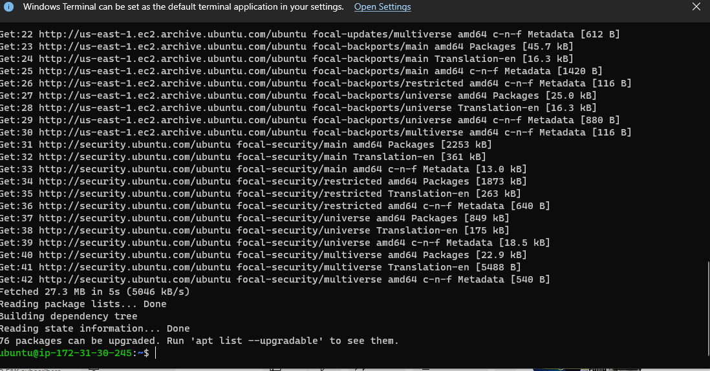

# Project 5:  Client/Server Architecture Using A MySQL Relational Database Management System

### Step 1: Create and configure two Linux-based virtual servers (EC2 instances in AWS) named mysql-server and mysql-client and below is the result.

When i finally connected to the terminal I ran `sudo apt update` Since this is my first time using apt for this session, so, i started off by updating my server’s package index and below is the output.

### Step 2:  Install MySQL Server software using `sudo apt install mysql-server -y` from mysql server console and below are the outputs from up to down.

### Step 3:  Install MySQL client software using `sudo apt install mysql-client -y` from mysql client console and below is the output.

### Step 4: Open TCP port 3306 in ‘Inbound rules’ in ‘mysql server’ Security Groups in the console and allow access only to the specific local IP address of your ‘mysql client’. Below is the result.

### Step 5: Configure MySQL server to allow connections from remote hosts by running `sudo vi /etc/mysql/mysql.conf.d/mysqld.cnf` and edited the bind-address to 0.0.0.0 and save. Below is the output.

### Step 6: Firstly, restart mysql using `sudo systemctl restart mysql` 

Log into mysql using `sudo mysql` in the mysql console run `select user, host from mysql.user;` to see the current users.

Create a new user called client using `CREATE USER 'client'@'%' IDENTIFIED BY ;password';`

Grant privileges to users and save changes using `GRANT ALL PRIVILEGES ON *.* TO 'client'@'%' WITH GRANT OPTION;` and `FLUSH PRIVILEGES;` and the outputs are below respectively.

Run `select user, host from mysql.user;` to see the new current users. Below is the output.

Finally, from mysql client Linux Server connect remotely to mysql server Database Engine without using SSH by running `mysql -h 172.31.30.245 -u client -p` (the private ip above is for mysql server) then, entr password whic was created when creatin user and hit enter. Below is the output.

Run `select user, host from mysql.user;` to see the new current users from mysql client console which is same as in mysql server. Below is the output.

### Step 7: To check that i have successfully connected to a remote MySQL server and can perform SQL queries i ran `Show databases;` which gave me the output below.
